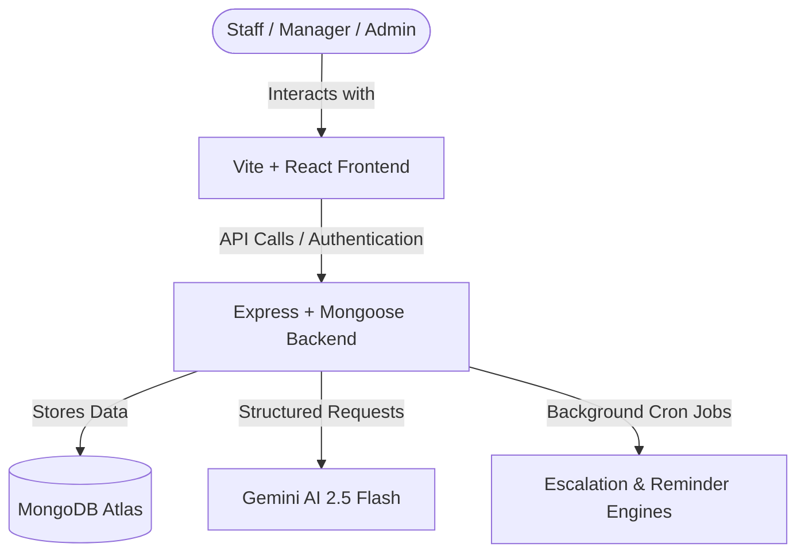

# FlowDesk (Opsrift) — AI-Powered Workspace & Operations Management System

> [!IMPORTANT]
> **🚀 Built specifically for the Tayo360 Full Stack Developer Interview**  
> This project was built from scratch as a custom technical demonstration for the Tayo360 team (specifically addressing the founder, Asheik, and the platform's requirements). It implements 100% of the core features requested in the job description: user management, role-based permissions (RBAC), scheduling workflows, documentation workflows, dashboard reporting, automated cron escalations, and six Gemini AI-powered workflow automation features.
> 
> *This repository serves as a live demonstration of Mustopha's full-stack development skills, architectural design capabilities, and passion for the scheduling/documentation space.*

## 🌟 About the Project
FlowDesk (Opsrift) is a dynamic scheduling and operations management platform designed to streamline workspace execution, task delegation, and report generation. The system is split into an **Express + TypeScript Backend** and a **Vite + React + Vanilla CSS Frontend**, equipped with **Gemini AI** capabilities to assist with task breaking, document refinements, prioritizations, and weekly summaries.

---

## 🏗️ Project Architecture



The repository consists of two main folders:
1. **[opsrift-backend](file:///c:/Users/abdul/Desktop/FlowDesk/opsrift-backend)**: Express API backend with Mongoose models, AI integrations, and cron jobs for task escalations.
2. **[opsrift-frontend](file:///c:/Users/abdul/Desktop/FlowDesk/opsrift-frontend)**: Vite-powered SPA React dashboard styled with pure custom CSS (no Tailwind) for optimal design aesthetics.

---

## 🚀 Core Platform Features

### 1. Dynamic Task Management & Bulk Creation
- Full CRUD operations for operational tasks (Title, Description, Roles, Assignee, Deadlines).
- Support for single task creation or bulk task ingestion.
- Admins can delete tasks directly from the details dashboard.

### 2. Goal-Oriented AI Checklist Breakdowns
- Managers input high-level business goals (e.g. "Migrate database to AWS").
- Gemini AI breaks down the goal into 3-5 concrete tasks, estimating deadlines and suggested assignee roles.
- Managers review, assign, and approve the checklist to create tasks in bulk instantly.

### 3. Authentic AI Documentation Refinements
- Operators document their completed work by typing raw notes (what they did, outcomes, issues).
- **AI Refine**: Polishes and formats the text professionally while keeping it entirely grounded in original facts (no fabrication of details).
- **Smart Doc Reviewer**: Automatically warns operators when notes are too vague before final submission.
- **AI Outcome Extraction**: Automatically summarizes the notes into a short, single-sentence outcome (e.g. "Memory leak resolved, response time down to 40ms").

### 4. Background Escalation & Reminder Engine
- Run by node-cron scheduler in the backend.
- **Due Soon Reminder**: Automatically alerts operators via dashboard notifications when a task is due within 24 hours.
- **Escalation Engine**: Automatically marks overdue tasks as "escalated" and flags them for manager review.

### 5. AI Operational Weekly Summaries
- Compiles all completed task documentation logs from the past week.
- Gemini AI generates a comprehensive weekly summary report highlighting team achievements and operational bottlenecks.

### 6. CSV & PDF Export Reporting
- Admins/managers can download full task lists and documentation logs as CSV reports.
- Supports clean PDF print layouts for tasks, details, and reports.

---

## 🛠️ Tech Stack

### Backend
- **Runtime & Core**: Node.js, TypeScript, Express.js
- **Database**: MongoDB (via Mongoose)
- **AI Integration**: `@google/genai` (using `gemini-2.5-flash` model)
- **Task Scheduling**: `node-cron`
- **Security**: JWT authentication, rate-limiting, Helmet, CORS

---

## ⚙️ Getting Started

### Prerequisites
- Node.js (v18 or higher)
- MongoDB Connection String
- Gemini API Key

### Installation & Run

#### Backend Setup
1. Navigate to backend:
   ```bash
   cd opsrift-backend
   ```
2. Install dependencies:
   ```bash
   npm install
   ```
3. Create a `.env` file (see backend README for variables details).
4. Run development server:
   ```bash
   npm run dev
   ```

#### Frontend Setup
1. Navigate to frontend:
   ```bash
   cd opsrift-frontend
   ```
2. Install dependencies:
   ```bash
   npm install
   ```
3. Create a `.env` file pointing to backend API.
4. Run development server:
   ```bash
   npm run dev
   ```
