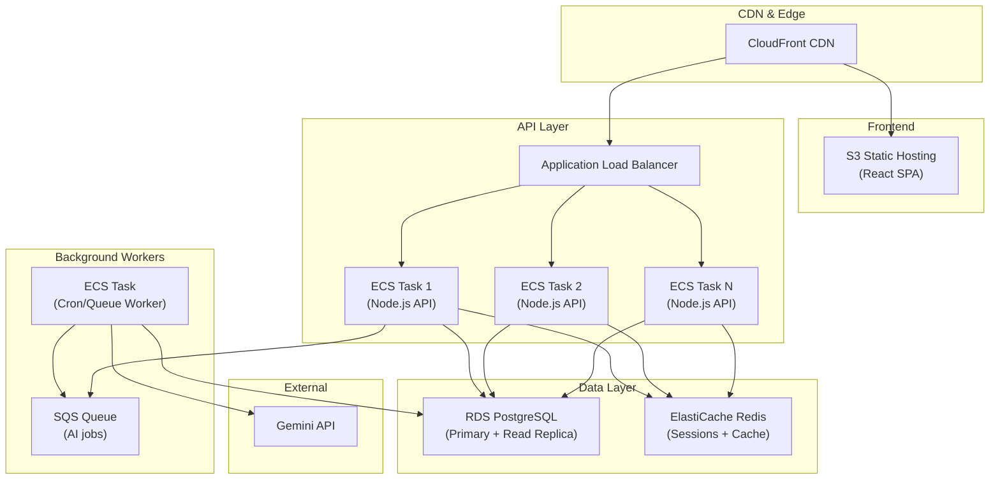

# 📐 Back-of-the-Envelope Analysis: Scaling OpsRift for Production

> **Context:** This analysis estimates what it would take to scale OpsRift from a single-developer prototype to a production SaaS platform serving the use case described in the Tayo360 JD — a scheduling, documentation, and workflow management platform for small-to-medium businesses.

---

## 1. Assumptions & Target Scale

| Metric | MVP (Current) | Growth Target (Year 1) | Scale Target (Year 3) |
|---|---|---|---|
| **Organizations (tenants)** | 1 | 50 | 500 |
| **Users per org** | 5–10 | 20–50 | 50–200 |
| **Total users** | ~10 | ~1,500 | ~50,000 |
| **Daily Active Users (DAU)** | ~5 | ~500 | ~15,000 |
| **Tasks created/day** | ~10 | ~1,000 | ~25,000 |
| **Docs submitted/day** | ~5 | ~500 | ~10,000 |
| **API requests/day** | ~500 | ~100K | ~5M |

---

## 2. Traffic Estimation (Back of Envelope)

### 2.1 API Request Breakdown (per DAU)

| Action | Requests per session | Sessions/day | Total |
|---|---|---|---|
| Login / token refresh | 1 | 1 | 1 |
| Dashboard load (stats + notifications) | 3 | 2 | 6 |
| Task list + filters | 2 | 5 | 10 |
| Task detail + doc view | 2 | 3 | 6 |
| Task create/update | 1 | 2 | 2 |
| Doc submission | 1 | 1 | 1 |
| Notification polling | 1 | 10 | 10 |
| **Total per DAU** | | | **~36 requests** |

### 2.2 Peak Traffic

- **At 500 DAU:** 500 × 36 = **18,000 requests/day** → ~0.2 RPS avg, ~2 RPS peak
- **At 15K DAU:** 15K × 36 = **540,000 requests/day** → ~6 RPS avg, ~60 RPS peak (assuming 10x peak-to-avg ratio)
- **At 50K DAU:** 50K × 36 = **1.8M requests/day** → ~21 RPS avg, ~210 RPS peak

> [!NOTE]
> These are well within the capacity of a single Node.js server until ~5K DAU. Beyond that, horizontal scaling becomes necessary.

### 2.3 Bandwidth

- Average API response: ~2 KB JSON
- At 50K DAU: 1.8M × 2 KB = **~3.6 GB/day** outbound → negligible for modern infra

---

## 3. Database Sizing & Strategy

### 3.1 Storage Estimation

| Collection | Avg doc size | Growth/day (at scale) | Annual storage |
|---|---|---|---|
| Users | 0.5 KB | ~50 new/day | ~9 MB |
| Tasks | 1 KB | ~25,000/day | ~9 GB |
| Docs | 3 KB | ~10,000/day | ~11 GB |
| Notifications | 0.5 KB | ~50,000/day | ~9 GB |
| **Total** | | | **~30 GB/year** |

> [!TIP]
> At this scale, MongoDB Atlas M10–M30 tier or a single PostgreSQL RDS instance (db.r6g.large) handles this comfortably. The bottleneck is query latency, not storage.

### 3.2 MongoDB → PostgreSQL Migration Path

The JD specifies PostgreSQL. Migration strategy:

```
Phase 1: Dual-write adapter (Mongoose → Prisma)
Phase 2: Migrate schema (User, Task, Doc, Notification → relational tables)
Phase 3: Add foreign keys, indexes, and migration tooling
Phase 4: Cutover with data migration script
```

**Key Schema Changes:**
- `Task.assignedTo` / `Task.createdBy` → `FOREIGN KEY REFERENCES users(id)`
- `Doc.taskId` → `FOREIGN KEY REFERENCES tasks(id) ON DELETE CASCADE`
- Notification `referenceId` → polymorphic reference or separate FK columns
- Add `organization_id` to all tables for multi-tenancy

### 3.3 Indexing Strategy

```sql
-- Critical indexes for query performance
CREATE INDEX idx_tasks_assigned_status ON tasks(assigned_to, status);
CREATE INDEX idx_tasks_due_date ON tasks(due_date) WHERE status IN ('pending', 'inprogress');
CREATE INDEX idx_tasks_org_status ON tasks(organization_id, status);
CREATE INDEX idx_docs_task_id ON docs(task_id);
CREATE INDEX idx_notifications_user_read ON notifications(user_id, read);
CREATE INDEX idx_users_org_role ON users(organization_id, role);
```

---

## 4. AI Service Scaling

### 4.1 Current Gemini API Usage

| Function | Calls/day (at scale) | Avg tokens | Est. cost/call | Daily cost |
|---|---|---|---|---|
| `breakdownGoal()` | ~500 | ~800 | $0.002 | $1.00 |
| `generateDraft()` | ~2,000 | ~1,200 | $0.003 | $6.00 |
| `reviewNotes()` | ~5,000 | ~400 | $0.001 | $5.00 |
| `refineNotes()` | ~3,000 | ~600 | $0.0015 | $4.50 |
| `generateWeeklySummary()` | ~500 orgs × 1/week | ~2,000 | $0.005 | $0.36 |
| `prioritizeTasks()` | ~1,000 | ~600 | $0.0015 | $1.50 |
| **Total** | | | | **~$18.36/day → $550/mo** |

### 4.2 Optimization Strategies

1. **Cache AI results**: Same task title/description → same breakdown. Use Redis with 24h TTL.
2. **Batch weekly summaries**: Instead of per-request Gemini calls, run as a nightly batch job.
3. **Rate limit AI endpoints**: 5 AI calls per user per hour to prevent abuse.
4. **Fallback tiers**: Gemini Flash (cheap) → Gemini Pro (quality) → local heuristic (free).

---

## 5. Infrastructure Architecture (Production)

### 5.1 Current Architecture (Single Server)

```
Client → Render (single Node.js) → MongoDB Atlas
                     ↓
              Gemini API (external)
```

### 5.2 Production Architecture (AWS)



### 5.3 Key Infrastructure Decisions

| Decision | Choice | Rationale |
|---|---|---|
| **Compute** | AWS ECS Fargate | Serverless containers, auto-scales, no EC2 management |
| **Database** | RDS PostgreSQL (Multi-AZ) | JD requirement + relational integrity for scheduling data |
| **Cache** | ElastiCache Redis | JWT session validation, AI response cache, rate limiting |
| **Queue** | SQS + Lambda / BullMQ | Decouple AI calls from request cycle |
| **CDN** | CloudFront + S3 | Static SPA delivery, global edge caching |
| **Real-time** | API Gateway WebSocket / Socket.io on ECS | Replace notification polling |
| **Monitoring** | CloudWatch + X-Ray | Distributed tracing across services |

---

## 6. Cron Jobs → Queue Architecture

### 6.1 Current Problem

Cron jobs run **inside the API process**. At scale this means:
- Cron competes with API requests for CPU/memory
- If the process restarts, cron state is lost
- Can't scale API horizontally without duplicate cron executions

### 6.2 Production Solution

```
                           ┌─────────────────┐
EventBridge Schedule ────> │  SQS Queue       │
(replaces node-cron)       │  (task-escalation)│
                           └────────┬──────────┘
                                    │
                           ┌────────▼──────────┐
                           │  Worker Service    │
                           │  (ECS Fargate)     │
                           │  - Process tasks   │
                           │  - Call Gemini     │
                           │  - Write to DB     │
                           └────────────────────┘
```

**Migration steps:**
1. Extract cron logic into standalone handler functions (already modular in `escalation.cron.ts`)
2. Replace `node-cron` schedules with AWS EventBridge rules
3. EventBridge pushes events to SQS
4. Dedicated worker service consumes from SQS
5. Worker runs task escalation, reminders, and AI summary generation

---

## 7. Multi-Tenancy Design

### 7.1 Strategy: Shared Database, Tenant-Scoped Rows

```sql
-- Every table gets an organization_id column
ALTER TABLE tasks ADD COLUMN organization_id UUID REFERENCES organizations(id);
ALTER TABLE docs ADD COLUMN organization_id UUID REFERENCES organizations(id);
ALTER TABLE notifications ADD COLUMN organization_id UUID REFERENCES organizations(id);

-- Row-level security (PostgreSQL)
CREATE POLICY tenant_isolation ON tasks
  USING (organization_id = current_setting('app.tenant_id')::uuid);
```

### 7.2 Middleware Injection

```typescript
// tenant.middleware.ts
const tenantMiddleware = (req, res, next) => {
  const tenantId = req.user.organizationId; // from JWT
  req.tenantId = tenantId;
  // Set PostgreSQL session variable for RLS
  db.query(`SET app.tenant_id = '${tenantId}'`);
  next();
};
```

---

## 8. Real-Time Notifications (WebSocket)

### 8.1 Current: Polling

```
Frontend polls GET /api/notifications every 30s → wastes bandwidth, high latency
```

### 8.2 Scaled: WebSocket with Redis Pub/Sub

```
Server emits event → Redis Pub/Sub → All connected API instances → WebSocket to client

Socket.io + @socket.io/redis-adapter
- Supports horizontal scaling across multiple API instances
- Each instance subscribes to Redis channels
- Client connects once, receives push updates
```

**Estimated savings:** At 15K DAU polling every 30s = 43.2M requests/day → WebSocket reduces to ~50K event pushes/day (99.9% reduction).

---

## 9. Security Hardening for Production

| Layer | Current | Production Upgrade |
|---|---|---|
| **Auth tokens** | localStorage JWT | httpOnly secure cookies + CSRF token |
| **Rate limiting** | In-memory (express-rate-limit) | Redis-backed (rate-limit-redis) across instances |
| **Input validation** | Basic middleware | Zod schemas on every endpoint |
| **Secrets** | `.env` file | AWS Secrets Manager / SSM Parameter Store |
| **Logging** | `console.log` | Structured JSON logging (Winston/Pino) → CloudWatch |
| **Audit trail** | None | Append-only audit log table for compliance |
| **CORS** | Single origin | Per-tenant origin validation |

---

## 10. Cost Estimation (Monthly)

### 10.1 At 1,500 Users (Year 1 Growth)

| Service | Spec | Monthly Cost |
|---|---|---|
| ECS Fargate (2 tasks) | 0.5 vCPU, 1 GB each | $30 |
| RDS PostgreSQL | db.t4g.medium, 50 GB | $65 |
| ElastiCache Redis | cache.t4g.micro | $15 |
| S3 + CloudFront | Static SPA | $5 |
| Gemini API | ~$18/day | $550 |
| SQS + EventBridge | Low volume | $2 |
| CloudWatch | Basic monitoring | $10 |
| **Total** | | **~$677/mo** |

### 10.2 At 50,000 Users (Year 3 Scale)

| Service | Spec | Monthly Cost |
|---|---|---|
| ECS Fargate (6 tasks) | 1 vCPU, 2 GB each | $180 |
| RDS PostgreSQL (Multi-AZ) | db.r6g.large + read replica | $400 |
| ElastiCache Redis | cache.r6g.large (cluster) | $200 |
| S3 + CloudFront | Higher bandwidth | $50 |
| Gemini API (with caching) | ~$15/day (cached) | $450 |
| SQS + EventBridge + Lambda | Medium volume | $20 |
| CloudWatch + X-Ray | Full observability | $50 |
| WAF | Web Application Firewall | $30 |
| **Total** | | **~$1,380/mo** |

> [!IMPORTANT]
> The largest cost driver is the Gemini API. Aggressive caching of AI responses and batching weekly summaries can reduce this by 40-60%.

---

## 11. Performance Bottlenecks & Solutions

| Bottleneck | When it hits | Solution |
|---|---|---|
| **Single Node.js process** | >2K concurrent connections | Horizontal scaling via ECS + ALB |
| **MongoDB query latency** | >10K tasks per org | Migrate to PostgreSQL + proper indexing |
| **Notification polling** | >5K DAU | WebSocket with Redis Pub/Sub |
| **Cron in API process** | Any horizontal scaling | EventBridge + SQS worker architecture |
| **Gemini API latency** (2-5s) | Every AI feature request | Queue + async processing, cache responses |
| **JWT in localStorage** | Security audit | httpOnly cookies + CSRF protection |
| **No multi-tenancy** | >1 organization | Org-scoped data with RLS policies |

---

## 12. Phased Migration Roadmap

### Phase 1: Production-Ready (Weeks 1–4)
- [ ] Migrate MongoDB → PostgreSQL with Prisma ORM
- [ ] Move secrets to AWS Secrets Manager
- [ ] Add structured logging (Pino → CloudWatch)
- [ ] Deploy to ECS Fargate behind ALB
- [ ] Add Zod input validation on all endpoints

### Phase 2: Multi-Tenant & Real-Time (Weeks 5–8)
- [ ] Add `organizations` table + multi-tenancy middleware
- [ ] Implement WebSocket notifications (Socket.io + Redis adapter)
- [ ] Extract cron jobs to EventBridge + SQS worker
- [ ] Add Redis caching layer for AI responses
- [ ] Implement httpOnly cookie auth

### Phase 3: Scale & Optimize (Weeks 9–12)
- [ ] Add RDS read replica for reporting queries
- [ ] Implement API response caching (Redis)
- [ ] Set up CI/CD pipeline (GitHub Actions → ECR → ECS)
- [ ] Add CloudWatch dashboards + alerting
- [ ] Load testing with Artillery/k6 (target: 200 RPS sustained)

---

> [!TIP]
> **Key interview talking point:** "I designed OpsRift as a vertical slice of the production system. The patterns I used — modular route architecture, middleware-based RBAC, service-layer AI abstraction, and scheduled background jobs — are the same patterns that scale. The migration path is well-defined: swap Mongoose for Prisma, swap node-cron for EventBridge, add Redis for caching, and containerize for ECS. The architecture doesn't need to be rewritten — it needs to be deployed properly."
